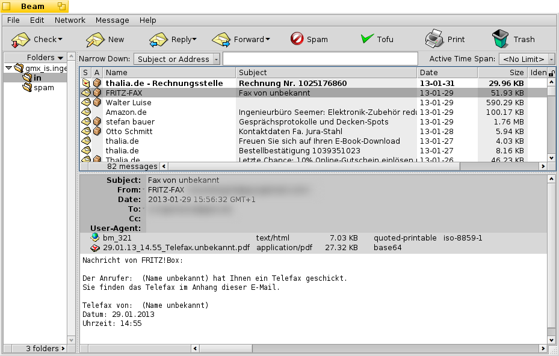

# Beam - BEware, Another Mailer #

Beam is a mail-client for BeOS/Haiku.

It is being developed by Oliver Tappe and distributed under the GPL
(see GnuGeneralPublicLicense.txt).

Software required by / used within Beam:

- The Layout Library (liblayout.so), by Marco Nelissen. Beam requires this to run!

- PCRE, Perl-Compatible-Regular-Expression library, by Philip Hazel. Beam requires
  this to run!

- Parts from SantasGiftBag, by Brian Tietz, hacked up a bit for use in Beam.

- Regexx, a C++-Regular-Expression library, by Gustavo Niemeyer, 
  ported to BString and hacked up a bit for use in Beam.

- Libiconv, a library that does conversion between different
  characterset-encodings, by Bruno Haible.

- OSBF from crm114, a bayes-like filter that's good for SPAM-filtering,
  by Fidelis Assis and Bill Yerazunis.

- openssl (if available), by the OpenSSL-team, is used to provide transport 
  layer security for all network traffic.

If you have questions, suggestions, complaints or a nice set of icons, 
you can reach the author at: <beam@hirschkaefer.de>.

Have fun!
